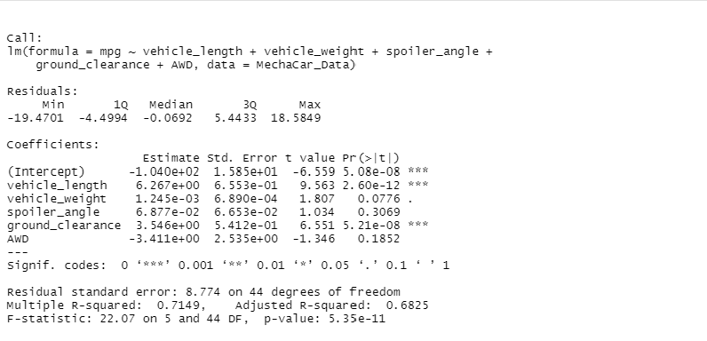
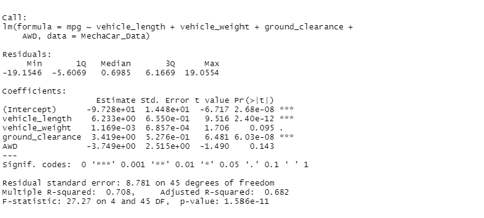
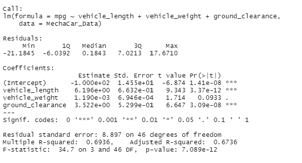
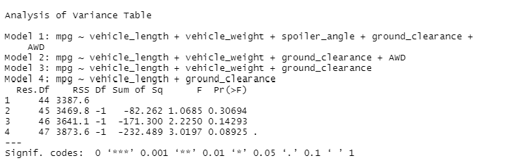
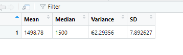
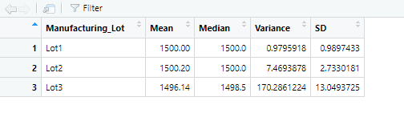
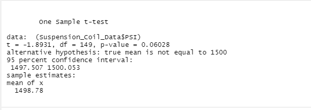
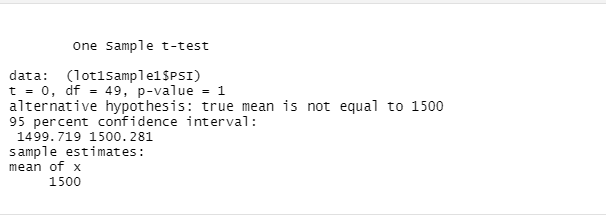
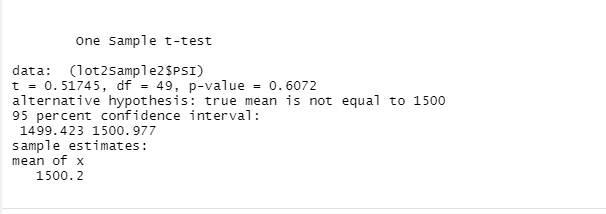
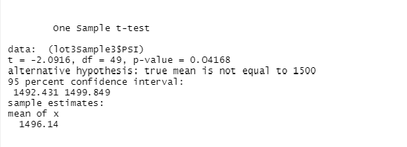

# Delivery 1
## Linear Regression to Predict MPG, and write a short summary using a screenshot of the output from the linear regression, and address the following questions:

### Which variables/coefficients provided a non-random amount of variance to the mpg values in the dataset?
Among the variables vehicle_length, vehicle_weight, spoiler_angle, ground_clearnance and AWD will provide non-random amount variance. 
Since we examined that mpg changes (dependent variable) are based on these pararmeters as independent variables.

FullModel

### Is the slope of the linear model considered to be zero? Why or why not?
Over all intercept is significant in the linear model (estimated value is -1.040e+02 p-value is 5.08e-08 *** as shown above, which is highly signifcant p<0.0001>) Therefore we can't ignore the slope. However, for the individual parameters including spolier_angle and AWD, their estimated values (slopes) were not significant from zero; we can ignore these paramters in the linear model analysis. 

### Does this linear model predict mpg of MechaCar prototypes effectively? Why or why not?

Overall the full model could predict mpg Mechar prototypes, but not effectively. We did model comparision using stepwise methods in which every time we remove the non-signifcant paramaters and check the model is significant from previous one(which is full model). Finally based on ANOVA analysis for models, the only simple model is :
mpg~ vehicle_length + ground_clearance. 
even this model can also predict the mpg prototypes as the same level of Full model were all paramaters were included. There was no differentce between these two models. In addition, in the full model the significant role of vehicle_weight was marginal (p=0.0776, marginal significant); however after removing non-signifcant predictors, the value of vehicle_weight became less significant (p=0.096). Usually researchers chose the simple model if there is no signifcant change.

FullModel

Model2 without spoiler_angle

Model3 removing spopoliler_angle and AWD

Model4 base on Model3 removing vehicle_weight

Compare three models

# Delivery 2
##  Summary Statistics on Suspension Coils

### The design specifications for the MechaCar suspension coils dictate that the variance of the suspension coils must not exceed 100 pounds per square inch. Does the current manufacturing data meet this design specification for all manufacturing lots in total and each lot individually? Why or why not?

Not satisfied the request in which the variance should be lower than 100 pound per square. Even though LOT1 and LOT2 were satisfied the requirements, but  LOT3 had variance as 170 as opposed to the required value 100 pound. The result was signifcant. 

TotalSummary

LOT sumamry

# Delivery 3
## T-Tests on Suspension Coils
Overall, from TotalTtest screenshot, PSI value Ttest was marginal signifcant (t = -1.8931, df = 149, p-value = 0.06028) from the population mean which is about 1500. It seems like one of the LOT may have different values. therefore, seperate T-tests were conducted at each Lot  group. In Lot1 and Lot2, there were no significant differences between sample values with overall population PSI values (for LOT1: t = 0, df = 49, p-value = 1 and for LOT2: t = 0.51745, df = 49, p-value = 0.6072) respectively(see LOT1Ttest and LOT2Ttest screenshot). However, in LOT3 there was a significant difference (t = -2.0916, df = 49, p-value = 0.04168) between sample and population in terms of PSI values according to the LOT3Ttest screenshot. LOT3 significant from population may create marginal differnce among total samples in three lots against population.

Total Ttest

T-Test on LOT1 group

T-test on LOT2 group

T-teston LOT3 group

# Delivery 4

## Study Design: MechaCar vs Competition

